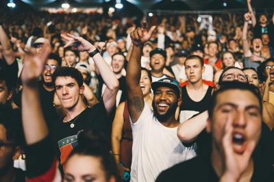

# Oh my image

It is the demo showing what can be done to the image.
Of course, with the help of the deep learning methods.

---

## To-do list

-   Loading image from everywhere;
-   Fit the image into well defined format;
-   Label the contains;
-   Image segmentation;
-   In-paint unwanted areas;
-   [n.a.] Reconstruct the 3D scene from the image.

---

## Load image

The dash app can do the collection job,
[dash_app.py](./image-loader/dash_app.py).
It establishes the front-end app that receives image,
the users can drag their beloved image into the page from everywhere.

The [my_image.py](./image-loader/my_image.py) receives the image and fit it into several versions.
The images are saved in the folder in [image](./image) folder.

## Fit image

The image will be re-size into fixed width for web usage.
It will automatically create the thumbnail image for icon usage.

## Label

The
[transformers](https://github.com/huggingface/transformers "transformers")
module is used to label the contains of the image.

It segments the image as well.

The [analysis_transformers.py](./image-analysis/analysis_transformers.py)
script runs over the [image](./image) folder,
and analysis the images.

The objects in the image are detected,
and the segmentation is performed to mask every possible objects.

-   Objects & Segmentation

    
    

-   Mask & Cover

    
    

## Depth

The
[transformers](https://github.com/huggingface/transformers "transformers")
also generate the depth map of the image.

It seems that the transformers module works just fine.

## In-paint

The masks are used to in-paint the unwanted areas.
The
[generative_inpainting](https://github.com/JiahuiYu/generative_inpainting "generative_inpainting")
module is used.
However, the problem is the project is released in the tensorflow version of 1.x.
So, I migrate it into the tensorflow version 2.x.
The detail can be found in the doc of [tensorflow-1to2.md](./doc/tensorflow-1to2.md).

The [inpaint_generative.py](./image-inpaint/inpaint_generative.py)
script runs over the [image](./image) folder,
and inpaint the image with the masks.

-   Inpaint 1

    
    

-   Inpaint 2

    
    

It seems that the generative module works a little strange.

## Reconstruction

[N.A.]
